Zeta-benchmark
==============

Here is the Benchmrking result between `Zeta` and `Express`, which is the most popular Web Framework in nodejs. 


# Test Configuration

## Test Type

There are six types of test.

- __send Html File__  (No template rendering test because that is highly dependent on what engine they use)
- __send string__
- __json serialization__
- __database read__ Use mongodb, and the db configuration is in db.js and bench.conf
- __database read & write__
- __large number of middlewares case__  Since `Express` use EventEmitter to trigger next middleware, while `Zeta` use another approach, so the test here is to compare the efficiency of each. The number here is only 5, but could be enough for this purpose.


## Test Tool
`Apache Bench` is used, and test each one with concurrency `[8,16,32,64,128,256]`.

```shell
ab -n 10000 -c [8,16,32,64,128,256] url
```

## How to run the test

1. `git clone https://github.com/BenBBear/Zeta-benchmark Zeta-benchmark && cd ./Zeta-benchmark/Express && npm install && cd ../Zeta && npm install && cd ..`
2. run `node ./Express/app.js && benchmark.py express && killall -KILL node` 
3. run `node ./Zeta/app.js && benchmark.py zeta && killall -KILL node`
4. run `analysis.py` to parse the json data, and plot figures, and save the figures into `img` folder.


# Test Result

## send html file

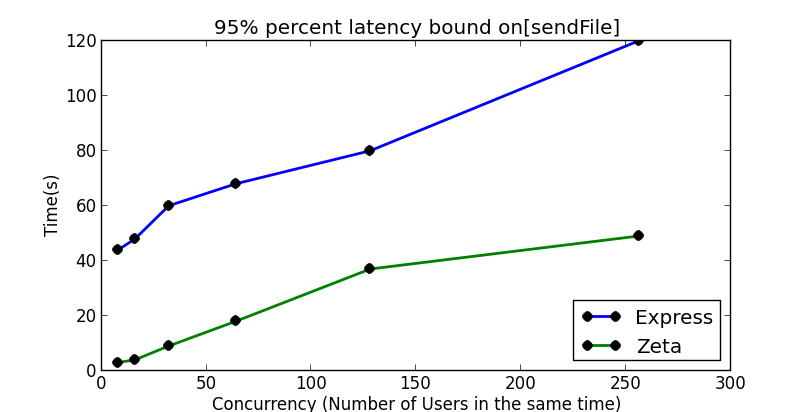
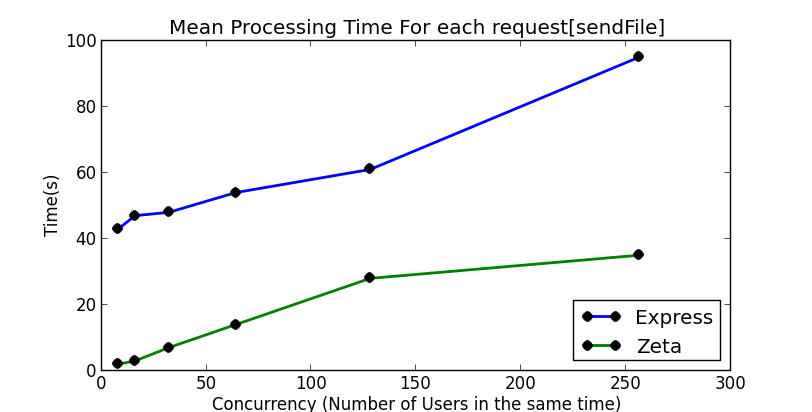
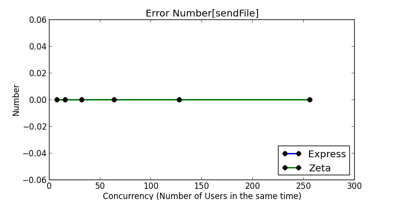


## send string

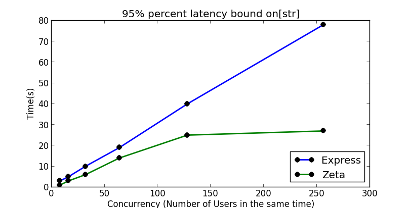
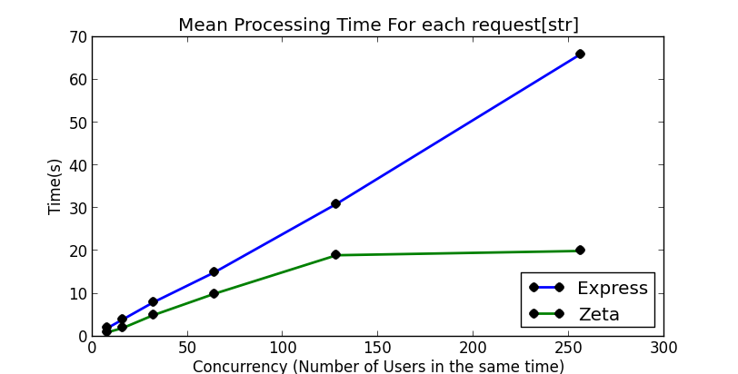
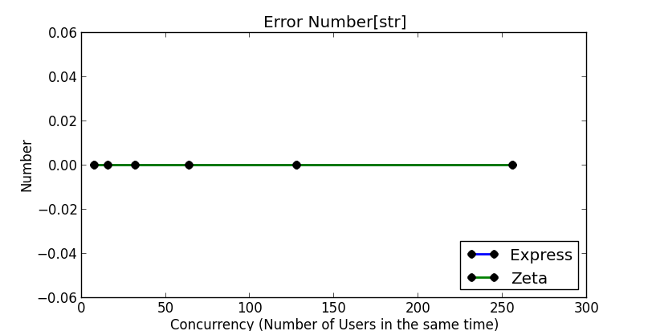

## json serialization
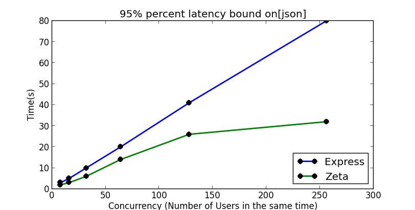
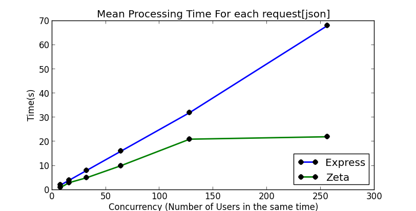


## db read
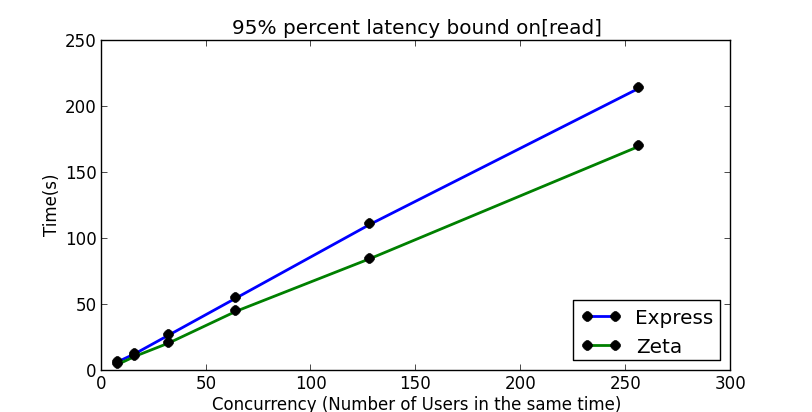
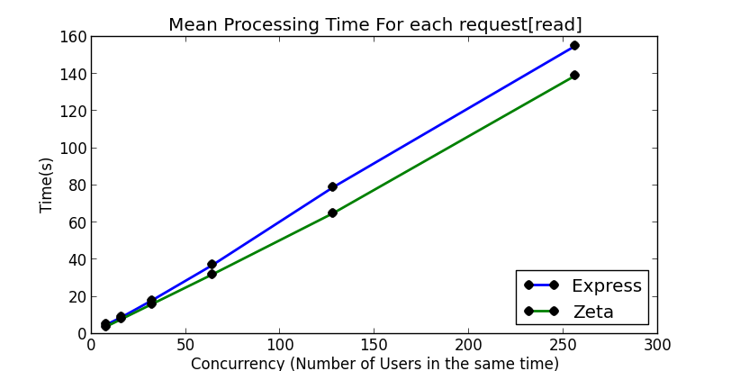
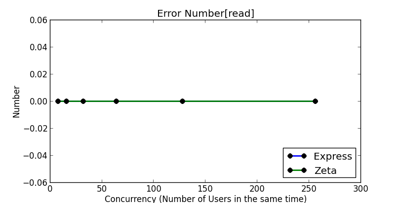

## db read && write

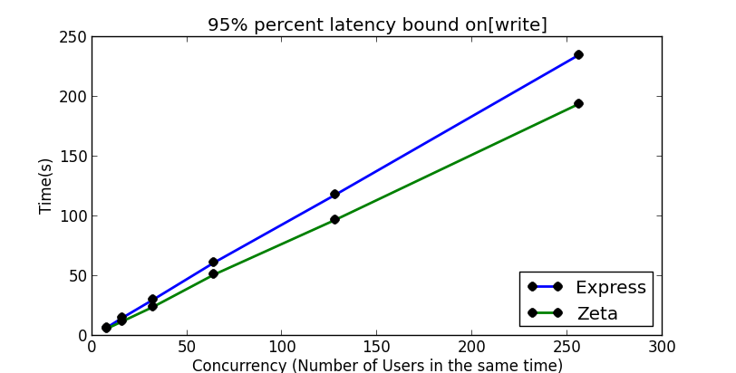
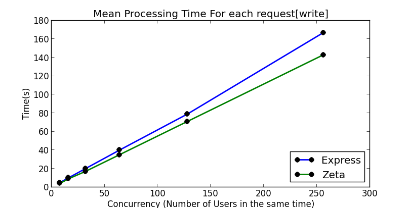
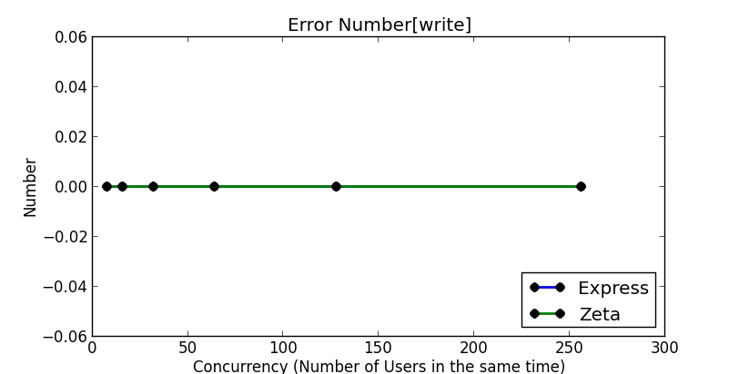

## multiple middleware
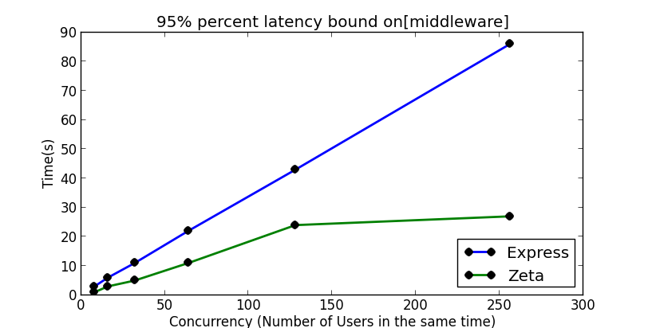
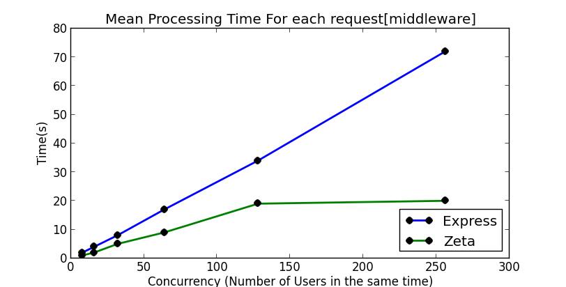
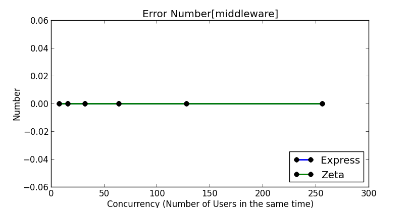


# Conclusion


The test here show that `Zeta` seems to be faster than `Express`, but we should see the benchmark here is very elementary. So it could be so bold to say that, but what we may have confidences on is that `Zeta` don't have too much speed problems.
